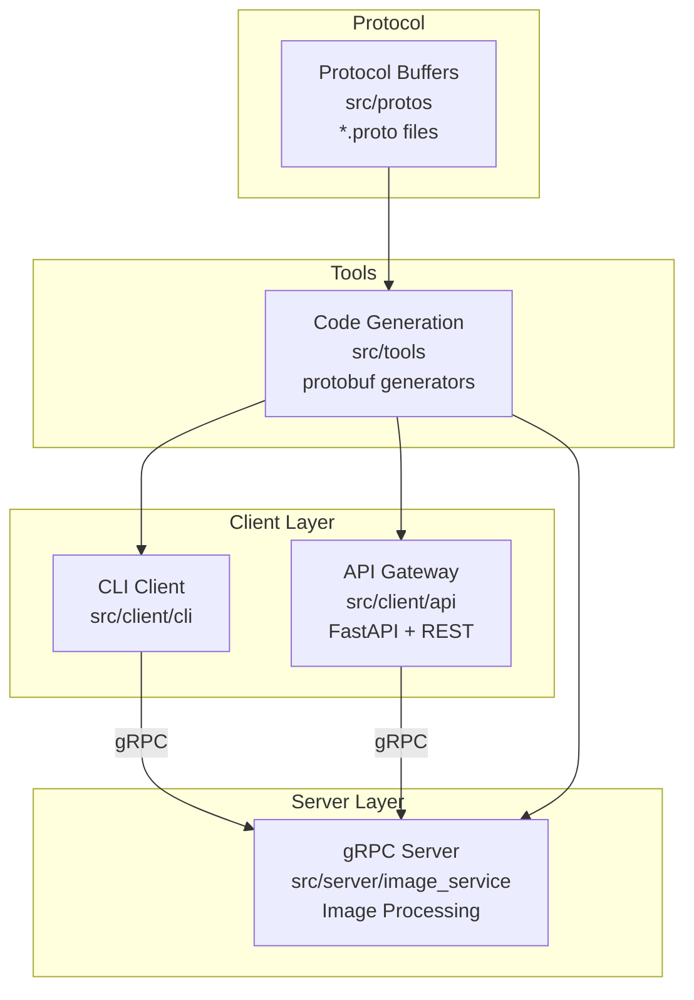
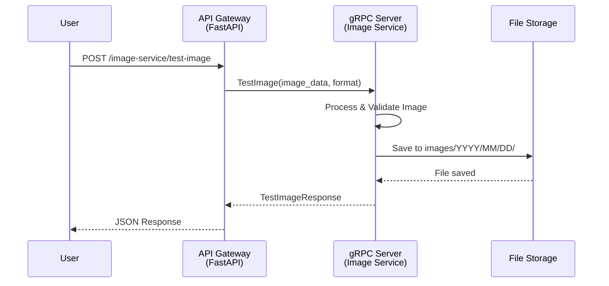
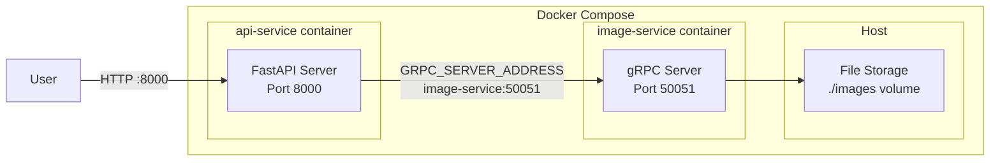

# gRPC Image Service POC

Proof of Concept project for gRPC Image Service with REST API Gateway

## Project Structure



## Architecture



## Docker Architecture



## Usage

### Prerequisites
- Python 3.12+
- uv (Python package manager)
- Docker & Docker Compose

### Quick Start

```bash
# 1. Install dependencies
make install

# 2. Generate protobuf files
make generate-proto

# 3. Run with Docker (recommended)
make monitor

# 4. Test the API
curl http://localhost:8000/image-service/health
```

### Available Commands

```bash
make help                 # Show available commands
make install             # Install all dependencies
make generate-proto      # Generate Python files from proto
make run-server          # Run gRPC server locally
make run-client          # Run CLI client
make run-client-api      # Run API Gateway locally
make monitor             # Start Docker services with logs
make clean               # Clean generated files
```

## API Endpoints

### REST API (Port 8000)

- `GET /` - API information
- `GET /image-service/health` - Health check
- `POST /image-service/test-image` - Upload and process image

### gRPC Service (Port 50051)

- `Health()` - Service health check
- `TestImage(image_data, image_format)` - Process image

## Environment Variables

| Variable | Default | Description |
|----------|---------|-------------|
| `GRPC_SERVER_ADDRESS` | `localhost:50051` | gRPC server address for API Gateway |

## Development

### Local Development
```bash
# Terminal 1: Run gRPC server
make run-server

# Terminal 2: Run API Gateway
make run-client-api
```

### Docker Development
```bash
# Start all services
make monitor

# Stop services
cd src/server && docker-compose down
```