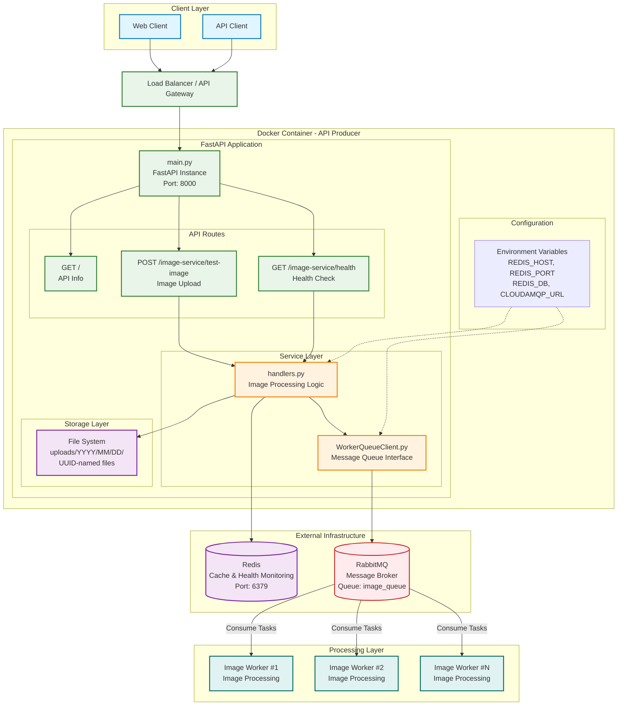

## Architecture

```mermaid
flowchart TB
    %% Client Layer
    subgraph "Client Layer"
        WebClient[Web Client]
        APIClient[API Client]
    end

    %% Load Balancer / Gateway
    LB[Load Balancer / API Gateway]

    %% FastAPI Application Container
    subgraph Docker["Docker Container - API Producer"]
        subgraph "FastAPI Application"
            direction TB
            MainApp[main.py<br/>FastAPI Instance<br/>Port: 8000]

            subgraph "API Routes"
                RootEndpoint[GET /<br/>API Info]
                HealthEndpoint[GET /image-service/health<br/>Health Check]
                UploadEndpoint[POST /image-service/test-image<br/>Image Upload]
            end

            subgraph "Service Layer"
                ImageHandler[handlers.py<br/>Image Processing Logic]
                QueueClient[WorkerQueueClient.py<br/>Message Queue Interface]
            end

            subgraph "Storage Layer"
                FileManager[File System<br/>uploads/YYYY/MM/DD/<br/>UUID-named files]
            end
        end

        subgraph "Configuration"
            EnvVars[Environment Variables<br/>REDIS_HOST, REDIS_PORT<br/>REDIS_DB, CLOUDAMQP_URL]
        end
    end

    %% External Services
    subgraph "External Infrastructure"
        Redis[(Redis<br/>Cache & Health Monitoring<br/>Port: 6379)]
        RabbitMQ[(RabbitMQ<br/>Message Broker<br/>Queue: image_queue)]
    end

    %% Worker Services
    subgraph "Processing Layer"
        Worker1[Image Worker #1<br/>Image Processing]
        Worker2[Image Worker #2<br/>Image Processing]
        WorkerN[Image Worker #N<br/>Image Processing]
    end

    %% Connections
    WebClient --> LB
    APIClient --> LB

    LB --> MainApp

    MainApp --> RootEndpoint
    MainApp --> HealthEndpoint
    MainApp --> UploadEndpoint

    UploadEndpoint --> ImageHandler
    HealthEndpoint --> ImageHandler

    ImageHandler --> QueueClient
    ImageHandler --> FileManager
    ImageHandler --> Redis

    QueueClient --> RabbitMQ

    RabbitMQ -->|Consume Tasks| Worker1
    RabbitMQ -->|Consume Tasks| Worker2
    RabbitMQ -->|Consume Tasks| WorkerN

    EnvVars -.-> ImageHandler
    EnvVars -.-> QueueClient

    %% Styling
    classDef clientLayer fill:#E1F5FE,stroke:#0277BD,stroke-width:2px
    classDef apiLayer fill:#E8F5E8,stroke:#2E7D32,stroke-width:2px
    classDef serviceLayer fill:#FFF3E0,stroke:#F57C00,stroke-width:2px
    classDef storageLayer fill:#F3E5F5,stroke:#7B1FA2,stroke-width:2px
    classDef infrastructure fill:#FFEBEE,stroke:#C62828,stroke-width:2px
    classDef processing fill:#E0F2F1,stroke:#00695C,stroke-width:2px

    class WebClient,MobileApp,APIClient clientLayer
    class LB,MainApp,RootEndpoint,HealthEndpoint,UploadEndpoint apiLayer
    class ImageHandler,QueueClient serviceLayer
    class FileManager,Redis storageLayer
    class RabbitMQ infrastructure
    class Worker1,Worker2,WorkerN processing
```
